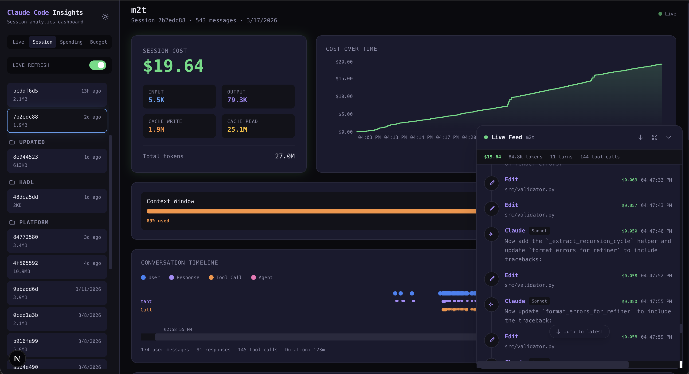

# Claude Code Insights

A real-time analytics dashboard for [Claude Code](https://docs.anthropic.com/en/docs/claude-code) sessions. Track spending, monitor token usage, analyze tool activity, and watch live sessions — all from a local web UI.



## Features

### Session Analytics
- **Cost tracking** — cumulative cost chart per session with model-level breakdown
- **Token usage** — input, output, cache read, and cache write token counts
- **Model breakdown** — see which models (Opus, Sonnet, Haiku) were used and their cost share
- **Tool usage** — bar chart of tool calls (Read, Edit, Write, Bash, Grep, Glob, Agent, etc.)
- **Cost per turn** — see how much each user prompt cost to process
- **File heatmap** — which files were read, edited, and written most
- **Conversation timeline** — visual timeline of user messages, assistant responses, and tool calls
- **Agent panel** — track sub-agents spawned during a session with their individual costs and full prompts
- **Context window** — real-time progress bar showing how full the context is, with compaction markers
- **Compaction insights** — see when compactions happened, how many tokens were freed, and context usage over time

### Mission Control
- **Live monitoring** — real-time view of all active Claude Code sessions across projects
- **Unified activity feed** — see user messages, tool calls, and agent spawns as they happen
- **Multi-session overview** — cost and status at a glance for every running session

### Spending Overview
- **Daily spending chart** — aggregate costs over time (7 / 14 / 30 day windows)
- **Project breakdown** — see which projects are costing the most
- **Session and token totals** — daily summaries of sessions, tokens, and spend

### Budget Management
- **Spending limits** — set daily, weekly, and monthly budgets
- **Visual progress meters** — see how close you are to each limit at a glance
- **Browser notifications** — get alerted when spending hits a configurable threshold (default 90%) or exceeds the budget
- **Warning threshold slider** — customize when you want to be notified (50%–99%)
- **Persistent config** — budget settings are saved to `~/.claude/insights-config.json` so they survive browser clears and restarts

### Appearance
- **Dark / Light mode** — toggle between themes with the sun/moon button in the sidebar
- Theme preference is persisted in localStorage

## How It Works

Claude Code stores session logs as `.jsonl` files in `~/.claude/projects/`. This dashboard reads those logs directly from disk — no API keys, no external services, no data leaves your machine.

The parser extracts messages, token usage, tool calls, and cost data from each session log. Costs are calculated locally using Anthropic's published pricing.

## Getting Started

### Prerequisites

- [Node.js](https://nodejs.org/) 18+
- [Claude Code](https://docs.anthropic.com/en/docs/claude-code) installed and used at least once (so `~/.claude/projects/` exists)

### Install

```bash
git clone https://github.com/ThodorisTsampouris/claude-code-insights.git
cd claude-code-insights
npm install
```

### Run

```bash
npm run dev
```

Open [http://localhost:3141](http://localhost:3141) in your browser.

### Build for Production

```bash
npm run build
npm start
```

## Configuration

Copy the example environment file if you want to customize settings:

```bash
cp .env.example .env
```

| Variable | Default | Description |
|----------|---------|-------------|
| `PORT`   | `3141`  | Port the dashboard runs on |

## Tech Stack

- [Next.js](https://nextjs.org/) 15 with Turbopack
- [React](https://react.dev/) 19
- [Tailwind CSS](https://tailwindcss.com/) 4
- [Recharts](https://recharts.org/) for data visualization
- [Chokidar](https://github.com/paulmillr/chokidar) for file watching
- TypeScript

## Project Structure

```
src/
├── app/
│   ├── page.tsx              # Main dashboard
│   ├── layout.tsx            # Root layout
│   └── api/
│       ├── sessions/route.ts # Session list & detail API
│       ├── spending/route.ts # Aggregate spending API
│       ├── active/route.ts   # Active sessions API
│       └── budget/route.ts   # Budget config read/write API
├── lib/
│   ├── parser.ts             # JSONL log parsing & analysis
│   ├── pricing.ts            # Model pricing & cost calculation
│   ├── types.ts              # Shared TypeScript types
│   ├── useTheme.ts           # Dark/light theme hook
│   └── useBudget.ts          # Budget management hook
└── components/               # React UI components
    ├── CostCard.tsx
    ├── CostChart.tsx
    ├── CostPerTurn.tsx
    ├── ModelBreakdown.tsx
    ├── ToolUsage.tsx
    ├── SessionPicker.tsx
    ├── SpendingSummary.tsx
    ├── ConversationTimeline.tsx
    ├── FileHeatmap.tsx
    ├── AgentPanel.tsx
    ├── LiveFeed.tsx
    ├── MissionControl.tsx
    ├── BudgetSettings.tsx
    ├── BudgetBadge.tsx
    ├── ContextBar.tsx
    └── Modal.tsx
```

## Privacy

All data stays on your machine. The dashboard reads Claude Code's local session logs and performs all calculations client-side and server-side within your local Next.js instance. Nothing is sent to any external service.

## License

MIT
