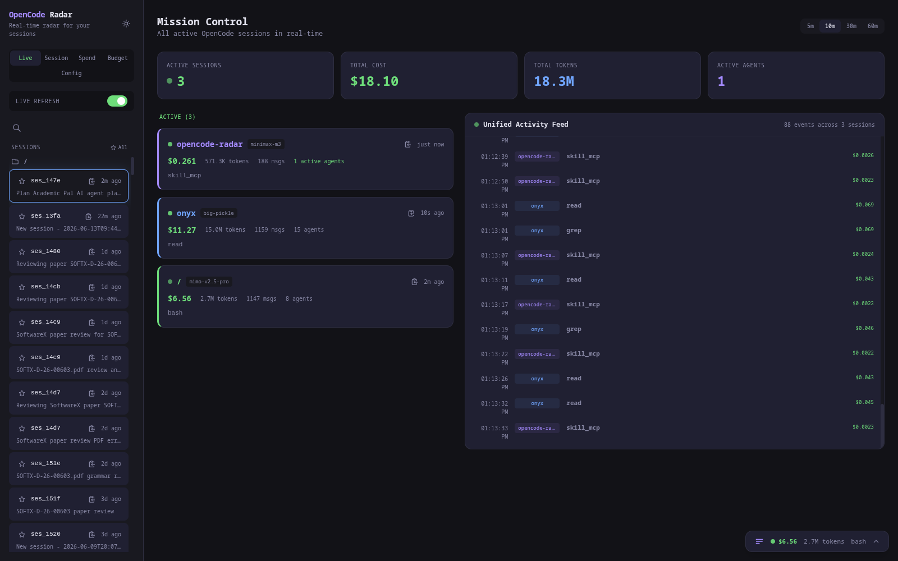
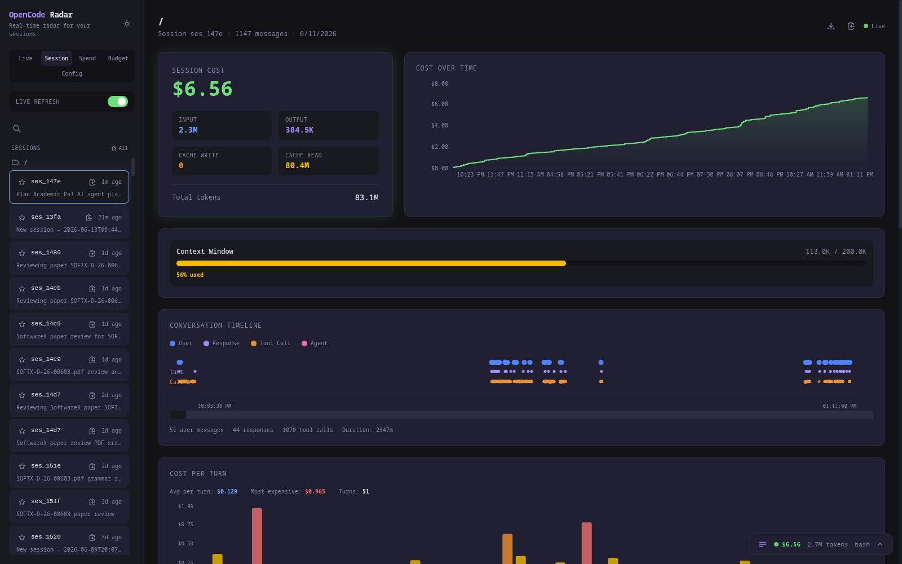
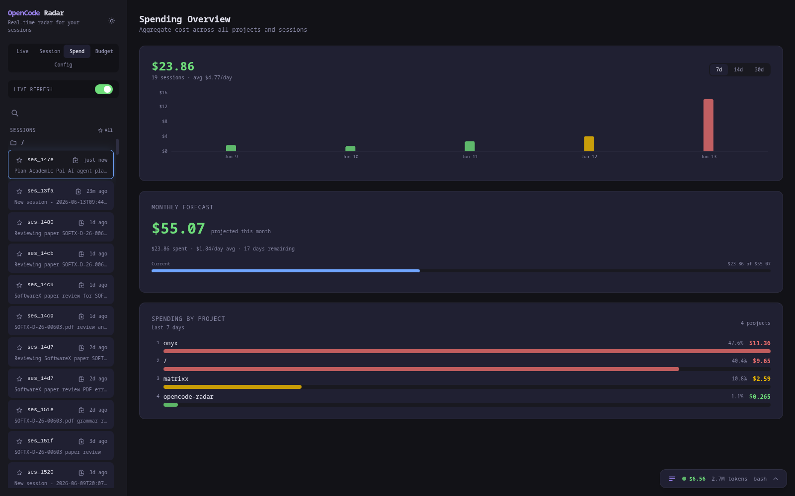
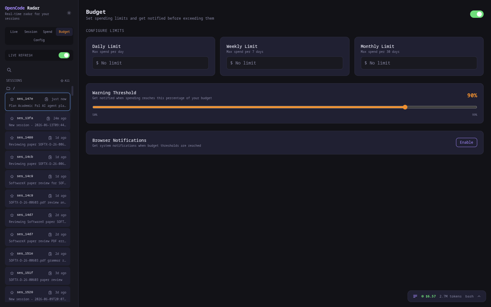

# OpenCode Radar

**Know exactly what your AI coding sessions cost — while they're happening.**

[](https://www.npmjs.com/package/opencode-radar)
[](LICENSE)
[](https://nodejs.org/)

OpenCode Radar is a local analytics dashboard for [OpenCode](https://opencode.ai) users. It reads your OpenCode SQLite database directly and gives you real-time visibility into session costs, token usage, agent activity, and spending trends — with zero configuration and no data leaving your machine.

---

<p align="center">
  
</p>

---

## ⚡ Quick Start

```bash
npx opencode-radar
```

First run builds the dashboard (~30s). Subsequent runs start instantly. Opens automatically in your browser at [http://localhost:3141](http://localhost:3141).

### Options

```bash
npx opencode-radar --port 8080   # custom port (default: 3141)
npx opencode-radar --rebuild     # force a fresh build
npx opencode-radar --help        # show all options
```

### Desktop App

Prefer a native window? Download the latest build for your platform from [Releases](https://github.com/klpanagi/opencode-radar/releases):

- **Linux** — `OpenCode Radar-*.AppImage` (portable)
- **macOS** — `OpenCode Radar-*.dmg` (Apple Silicon & Intel)
- **Windows** — `OpenCode Radar-Setup-*.exe`

To build the desktop app from source:

```bash
npm install
npm run electron:dist          # current platform
npm run electron:dist:linux    # AppImage
npm run electron:dist:mac      # .dmg
npm run electron:dist:win      # NSIS installer
```

### Prerequisites

- [Node.js](https://nodejs.org/) 18+
- [OpenCode](https://opencode.ai) installed and used at least once
- `git` in your `PATH` _(optional — enables the Git Activity panel)_

---

## Why OpenCode Radar?

OpenCode is powerful, but flying blind on costs adds up fast. Radar gives you the missing layer: a live view of every session, every sub-agent, every model call — with costs read straight from the database so the numbers are always exact. Know your burn rate before your API bill arrives.

---

## 🖥 Mission Control

A live, unified view of every running OpenCode session across all your projects.

<p align="center">
  
</p>

- **One pane of glass** — active sessions, total cost, total tokens, active agents at a glance
- **Unified activity feed** — user messages, tool calls, and agent spawns from every project merged by time, with per-event cost
- **Per-session card** — slug, model, message count, agent count, last tool used, and cost-so-far
- **Resume instantly** — copy `opencode -s <id>` to continue any session from your terminal

---

## 📊 Session Analytics

Per-session deep-dive: cumulative cost, token efficiency, model breakdown, tool usage, file heatmap, and a full conversation timeline.

<p align="center">
  
</p>

| Feature | Description |
|---|---|
| **Cost tracking** | Cumulative cost chart with per-model breakdown |
| **Token usage** | Input, output, cache read, cache write, and reasoning tokens |
| **Token efficiency** | Cost per file edit and cost per line changed |
| **Model breakdown** | Which models ran and their share of total cost |
| **Tool usage** | Bar chart of every tool call — Read, Edit, Write, Bash, Grep, Glob, task… |
| **Cost per turn** | How much each user prompt cost to process |
| **File heatmap** | Which files were read and edited most |
| **Conversation timeline** | Visual timeline of messages, tool calls, and agent spawns |
| **Agent panel** | Sub-agents spawned in a session with individual costs |
| **Context window** | Progress bar showing fill level, with compaction markers |
| **Git activity** | Commits made during the session, files changed, lines inserted/deleted |

---

## 💸 Spending Overview

Track total cost, see trends, forecast the month, and break down spend by project.

<p align="center">
  
</p>

- **Daily chart** over 7 / 14 / 30 day windows
- **Monthly forecast** based on the current daily average, with a progress bar to the projected total
- **Per-project breakdown** with percentage share and rank

---

## 💰 Budget Management

Set daily, weekly, and monthly spending limits. Get notified before you blow past them.

<p align="center">
  
</p>

- Set daily, weekly, and monthly limits
- Visual progress meters per budget period
- Browser notifications when spending hits your threshold
- Settings persist to `~/.local/share/opencode/insights-config.json`

---

## 🗂 Session Tools

- **Resume** — copy `opencode -s <id>` to clipboard in one click
- **Export** — download the full conversation as a Markdown file
- **Bookmarks** — star sessions to pin them; persists across restarts
- **Search** — full-text search across all session conversations

---

## 🔒 Privacy

Radar runs entirely on your machine. It reads OpenCode's local SQLite database and performs all processing inside your local Next.js instance. No telemetry. No external requests. No accounts.

---

## How It Works

OpenCode stores all session data in a SQLite database at `~/.local/share/opencode/opencode.db`. Radar reads that file directly using `better-sqlite3` — no API calls, no sync, no accounts.

Costs are read from `step-finish` events in the database exactly as OpenCode recorded them, so every figure is precise. Sub-agent sessions (spawned via `task()`) are attributed to their parent session so aggregate spending is never undercounted.

---

## 🛠 Development

```bash
git clone https://github.com/klpanagi/opencode-radar.git
cd opencode-radar
npm install
npm run dev
```

Open [http://localhost:3141](http://localhost:3141).

```bash
npm run build              # production build
npm start                  # serve production build
npm run electron:dev       # dev with Electron shell
npm run electron:build     # build unpacked Electron app
npm run electron:dist      # build platform-specific installer
```

---

## Tech Stack

| Layer | Technology |
|---|---|
| Framework | [Next.js](https://nextjs.org/) 15 with Turbopack |
| UI | [React](https://react.dev/) 19 + [Tailwind CSS](https://tailwindcss.com/) 4 |
| Charts | [Recharts](https://recharts.org/) |
| Database | [better-sqlite3](https://github.com/WiseLibs/better-sqlite3) |
| Desktop | [Electron](https://www.electronjs.org/) 41 |
| Language | TypeScript |

---

## Contributing

1. Fork the repo
2. Create a feature branch (`git checkout -b feat/your-feature`)
3. Commit your changes and open a PR

Bug reports and feature requests welcome via [GitHub Issues](https://github.com/klpanagi/opencode-radar/issues).

---

## License

MIT © [klpanagi](https://github.com/klpanagi)

---

_If Radar saves you from a surprise API bill, consider leaving a ⭐ — it helps others find it._
